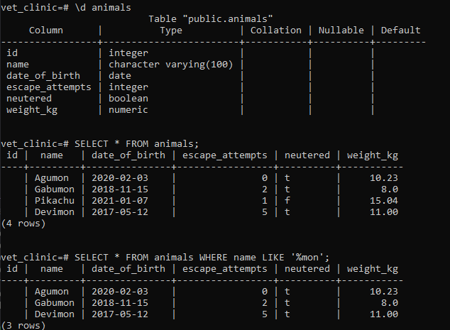

# Vet Clinic Database

> The project involves creating a relation database that contains several tables that interact with each other to create a vet clinic database.

## Project screenshots



Additional description about the project and its features.

## Built With

- SQL

## How to Setup

> You can simply clone or download [this repository](https://github.com/chukwuemeka1234/vet_clinic_database.git), and use your favorite browser or code editor to run this program.

- To open the project after download, simply double click the index.html file

- To open this project using vs code ( for this example) or your favorite code editor, you can follow the guide below:
  > in your cmd or command line navigate to where this project is located, then;

```cmd
cd vet-clinic
```

> thereafter run

```cmd
code .
```

## Author

👤 **Victor Chukwuemeka**

- GitHub: [@githubhandle](https://github.com/chukwuemeka1234/)
- Twitter: [@twitterhandle](https://twitter.com/@avc_victor)
- LinkedIn: [LinkedIn](https://www.linkedin.com/in/vic-chukwuemeka/)

## 🤝 Contributing

Contributions, issues, and feature requests are welcome!

Feel free to check the [issues page](../../issues/).

## Show your support

Give a ⭐️ if you like this project!

## Acknowledgments

- Microverse Team for facilitating project requirements and resources

## 📝 License

This project is [MIT](./MIT.md) licensed.